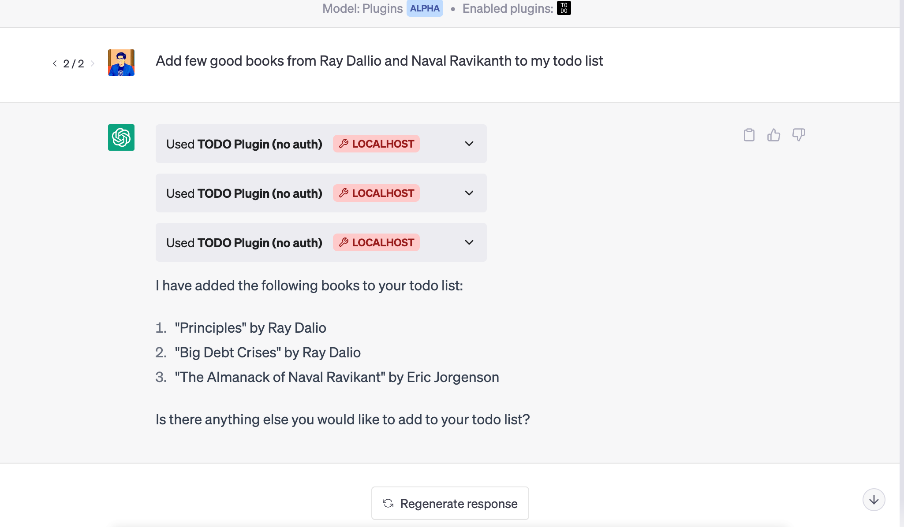

# ChatGPT CMD Plugin In NodeJs

This template repository will help you bootstrap your ChatGPT plugin development in NodeJs / Typescript. It provides a simple example of a CMD plugin for ChatGPT. The plugin allows users to interact with the windows command line interface.

If you do not already have plugin developer access, please [join the waitlist](https://openai.com/waitlist/plugins). This is similar to the python sample from OpenAI 

I would also suggest you to read the [plugin documentation from OpenAI](https://platform.openai.com/docs/plugins/) if you havn't done this yet.



## Features

- Interact with cmd

## Getting Started

### Prerequisites

- [Node.js](https://nodejs.org/en/download/)
- [npm](https://www.npmjs.com/get-npm) (comes with Node.js)

### Installation

1. Clone the repository:

```sh
git clone https://github.com/kokilack611/chatgpt-plugin-cmd.git
cd chatgpt-plugin-cmd
```

2. Install the required dependencies:

```sh
npm install
```

### Running the project

For development:

```sh
npm start
```


Once the local server is running:

1. Navigate to https://chat.openai.com. 
2. In the Model drop down, select "Plugins" (note, if you don't see it there, you don't have access yet).
3. Select "Plugin store"
4. Select "Develop your own plugin"
5. Enter in `localhost:5003` since this is the URL the server is running on locally, then select "Find manifest file".

The plugin should now be installed and enabled! You can start with a question like "What is on my D:/" and then try adding something to it as well! 

## API Endpoints

### Spawn a cmd

- URL: `/spawn`
- Method: `POST`
- Success Response: `200 OK` 

### Run a command

- URL: `/run`
- Method: `POST`
- Body: `{command}`
- Success Response: `200 OK` 

### Exit the shell

- URL: `/exit`
- Method: `POST`
- Success Response: `200 OK`

## Contributing

Contributions are welcome! Please create a fork of this repository, make your changes in a new branch, and submit a pull request.

## License

This project is licensed under the MIT License.
